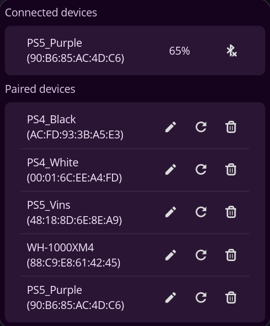

# cosmic-bluetooth-gamepad

COSMIC panel applet for managing Bluetooth game controllers.



Some controllers (e.g. PlayStation DualSense) does not automatically reconnect after being connected to a different device. This applet aims to solve that by allowing users to easily connect/disconnect controllers and auto-reconnect to previously paired controllers by their MAC address.

Main features:

- Connect/disconnect Bluetooth game controllers
- View battery level of connected controllers
- Auto-reconnect to previously paired controllers (This will remove the controller from the system Bluetooth settings, find, pair, trust and connect it automatically when in range)
- Rename paired controllers

## Dependencies

- BlueZ + DBus (system Bluetooth stack)
- Build dependencies for libcosmic on Debian-based systems:
  - cargo
  - cmake
  - just
  - pkg-config
  - libxkbcommon-dev
  - libwayland-dev
  - libgl1-mesa-dev
  - libssl-dev
  - libexpat1-dev
  - libfontconfig-dev
  - libfreetype-dev

## Build

```bash
cargo build --release
```

## Build/Install with just

```bash
# build
just build

# install for current user
just install

# uninstall
just uninstall
```

## Usage
Open **COSMIC Settings → Desktop → Panel → Applets** and add “Cosmic Bluetooth Gamepad” to your panel.

If you have previously paired controllers via system Bluetooth settings and then reconnect the device:
1. Open the applet menu
2. Find the controller in the paired list
3. Click the "Reconnect"
4. The applet will remove the device from system Bluetooth settings start a 60 second countdown
5. During the countdown, make the controller discoverable (on ps4/ps5 controllers, hold the Share button + PS button until the light bar starts flashing)
6. The applet will find, pair, trust and connect the controller automatically